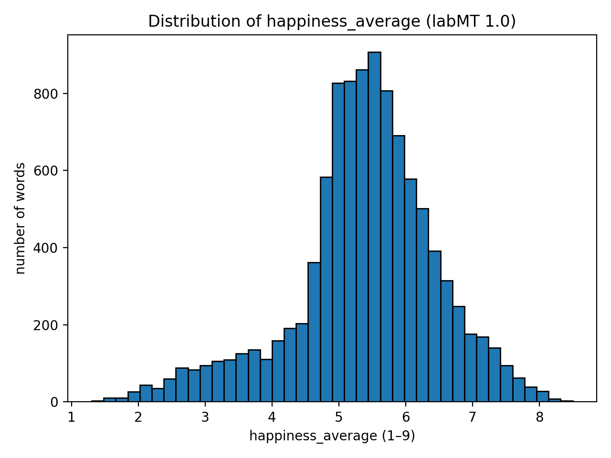
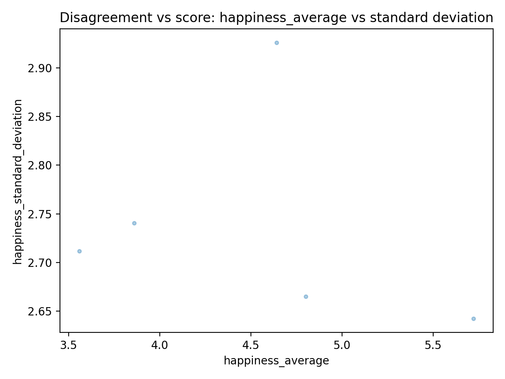
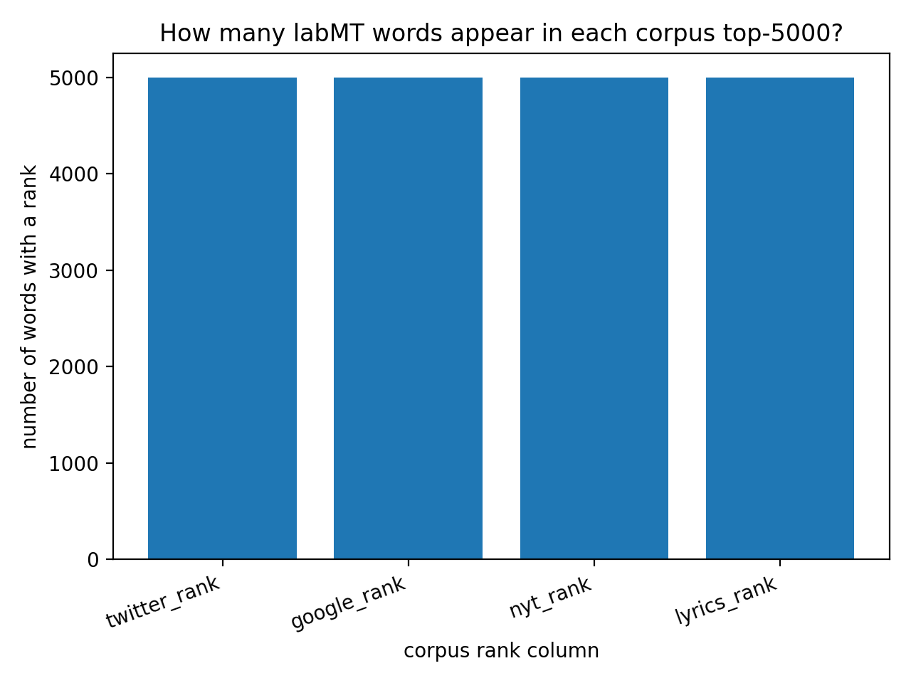
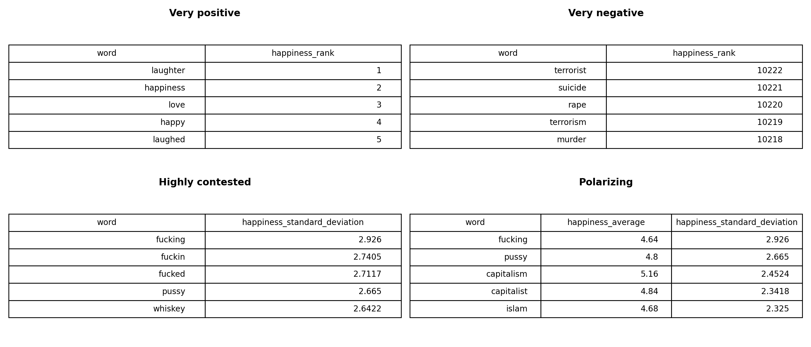

# Happiness According to Mechanical Turks: Exploring the labMT 1.0 Hedonometer Dataset

This repository explores the **labMT 1.0** (“language assessment by Mechanical Turk”) dataset used to build a large‑scale *hedonometer* for English text, originally introduced by Dodds et al. (2011). We combine basic quantitative analysis (distributions, corpus comparisons) with qualitative close reading of selected words to reflect on what this dataset can – and cannot – tell us about “happiness” in language. [3][8]

---

## 1. Project overview

Our goal in this project is to:

- understand the structure of the labMT 1.0 lexicon and how it encodes “happiness” scores for words,
- describe what the dataset looks like statistically (distributions, disagreement, corpus differences),
- build a small exhibit of words that invites qualitative interpretation,
- critically reflect on how the dataset was generated and what its design choices make visible or invisible. [3][8][11]

The repository is organized following the course assignment:

- `src/` – Python scripts (data loading, cleaning, and analysis),
- `data/` – the labMT 1.0 data (`data/raw/Data_Set_S1.txt`),
- `figures/` – plots generated by our scripts (outputs),
- `tables/` - csv files (outputs)
- `README.md` – this document, which serves as our main “publication.” [8]

---

## 2. Dataset

### 2.1 Source and provenance

We work with the **labMT 1.0** dataset supplied in the course materials (`Data_Set_S1.txt`). The dataset was originally constructed by:

1. Collecting a list of common English words from several large corpora (Twitter, Google Books, the New York Times, song lyrics).
2. Asking crowd workers on Amazon Mechanical Turk to rate each word on a numeric happiness scale.
3. Aggregating these ratings into average happiness scores, standard deviations, and rank information per corpus. [3][6][11]

The file we use is a **tab‑delimited text file** with several metadata lines at the top, followed by a header row and one row per word.

> We will reconstruct this pipeline and discuss its consequences in more detail in the *Critical reflection* section (Section 6). [11]

---

We load the dataset using Python + `pandas` as follows: [7]

- We read the raw tab‑delimited file `data/raw/Data_Set_S1.txt`.
- Because the file contains metadata/comment lines at the top, we **search for the header row** programmatically by looking for the first line that contains both the strings `word` and `happiness` separated by tabs.
- We then call `pandas.read_csv` with:
  - `sep="\t"` to parse tab‑delimited columns,
  - `skiprows=<header_index>` so that all metadata lines above the header are skipped,
  - `na_values=["--"]` so that the placeholder `--` is treated as a missing value (`NaN`),
  - `dtype=str` initially, and convert numeric columns afterwards.
- After loading, we:
  - strip whitespace from column names,
  - convert all columns except `word` to numeric types using `pd.to_numeric(errors="coerce")`,
  - strip whitespace from the `word` column. [0][1][9][10]

This pipeline implements all code tasks for **Task 1.1 (Load the file)** from the assignment. [7]

**Shape of the cleaned DataFrame**

After loading and cleaning, our DataFrame has:

- **10,222 rows**
- **8 columns**

Shape (rows, cols): (10222, 8)

### 2.3 Create a data dictionary (Task 1.2)

This dataset contains one row per word from the labMT1.0 happiness lexicon. Each row records the average happiness score assigned by Mechanical Turk raters and frequency ranks of the word across several large corpora.

Columns include:

 - **word**
  - The English word evaluated in the labMT 1.0 lexicon. Each row corresponds to one word. 
  - Type: text 
  - Missing values: none

- **happiness_rank**
  - Rank of the word in the labMT happiness lexicon based on its average happiness score. Lower ranks correspond to lower happiness scores.
  - Type: integer
  - Missing values: none

- **happiness_average**
  - Average happiness score assigned by Mechanical Turk raters on a scale from 1 (least happy) to 9 (most happy).
  - Type: float
  - Missing values: none

- **happiness_standard_deviation**
  - Standard deviation of the happiness ratings across raters, indicating the level of agreement between annotators.
  - Type: float
  - Missing values: none

- **twitter_rank**
  - Frequency rank of the word among the 5,000 most common words in the Twitter corpus.
  - Type: integer
  - Missing values: some words are not present in the top-5000 list

- **google_rank**
  - Frequency rank of the word among the 5,000 most common words in the Google Books corpus.
  - ype: integer
  - Missing values: some words are not present in the top-5000 list

- **nyt_rank**
  - Frequency rank of the word among the 5,000 most common words in the New York Times corpus.
  - Type: integer
  - Missing values: some words are not present in the top-5000 list

- **lyrics_rank**
  - Frequency rank of the word among the 5,000 most common words in the song lyrics corpus.
  - Type: integer
  - Missing values: some words are not present in the top-5000 list

Additional tables generated by the analysis scripts are stored in the `tables/` .

### 2.4 Sanity checks (Task 1.3)

To ensure the dataset is correctly loaded and behaves as expected, we perform several sanity checks.

#### Duplicate words

We first check whether any words appear more than once in the dataset.
No duplicated words were found, confirming that each word in the lexicon is unique.
Random sample inspection

To verify that the dataset was parsed correctly, we inspect a random sample of 15 rows:

`tables/random_sample_15_rows.csv`

The sample shows that:
1. each row represents one word,
2. numeric values fall within plausible ranges,
3. missing values appear only in corpus rank columns.

This confirms that the dataset structure has been correctly reconstructed.
Most positive and most negative words

We identify the 10 most positive and 10 most negative words based on their average happiness score.

Results are saved in:

  `tables/top_10_positive_words.csv`
  `tables/top_10_negative_words.csv`

The most positive words include terms such as:

- *laughter*
- *happiness*
- *love*
- *happy*

The most negative words include:

- *terrorist*
- *suicide*
- *rape*
- *murder*
- *death*

These results do indeed conform to people's perception of happiness.

However, what “makes sense” can also dependent on culture and contents. The happiness scores represent average judgments from Mechanical Turk workers, not universal emotional truths. Words may evoke different emotional responses in different communities or contexts.

All tables referenced in this section are generated automatically by the analysis scripts in `src/` and stored in the `tables/` directory.

## 3. Method section 

### 3.1 The usage of AI tools
 
Due to the tight deadline and the lack of strong programming skills among our group members, we utilized intelligent tools, including UVA AI, to assist in writing and modifying the code. First, we reviewed the course content and project guidelines to understand the coding techniques required for this exercise. When writing code to clean the data, we followed the task's logical requirements, with AI guiding our code writing. During this process, we encountered code errors, possibly caused by an error in the AI's file path specification. We needed to modify the AI's suggestions based on our local operating environment and file paths, ultimately completing the cleaning and organization of the raw data. Generating relevant statistical charts for qualitative and quantitative analysis proved challenging. Again, we relied on intelligent tools to ensure the generated charts accurately reflected the required data while being neat and aesthetically pleasing. To ensure every group member fully understood the code, we had the AI ​​provide a detailed explanation of each line, including its function and the programming techniques used. We then used Python's comment function (#) to annotate these points of difficulty below the corresponding lines of code.

AI is a great help to us quickly learn code and advance tasks. We use it to guide us in writing code and help us analyze errors. At the same time, we don't forget not to lose control of the code. We require the AI ​​to interpret everything it generates to ensure that the entire project is always under our control, and to let the AI ​​only serve as an auxiliary tool to provide technical support. AI was of particular use in the creation of plots for the qualitative analysis, as well as for piecing together interpretations of the code written by our team members. 

### 3.2 Method for quantitative exploration

We examined the distribution of happiness_average scores by computing summary statistics and visualizing the distribution with a histogram.
We quantified disagreement using happiness_standard_deviation, plotted it against happiness_average, and identified the 15 words with the highest standard deviation as the most “contested”.
Using corpus-specific rank fields (Twitter, Google Books, New York Times, song lyrics), we calculated coverage (number of words with non-missing ranks), pairwise overlaps between corpora, and highlighted words highly ranked in Twitter but absent from the NYT top 5000. All tables were exported as cvs and figures saved as .png.

### 3.3 Method for qualitative exploration

We first imported the cleaned dataset using the function load_labmt from the data cleaning file load_labmt.py. We also imported the analyse_disagreement function, the save_csv function and the save_figure function from the quantitative_exploration.py file, as well as pandas and matplotlib.pyplot. Our goal was to have the happiness ranks and standard deviations for all words so that we could create our qualitative exploration "Word exhibit". We created separate tables showcasing the 5 most positive, negative, highly contested and polarizing words (the last category was our addition to the requirements of the assignment), as well as their happiness rank and/or (where pertinent) standard deviation. After printing all tables so that we get an idea of what kinds of words make up each category, we created a new table that included all the aforementioned categories in decending order. Using the save_csv function we saved a comma-delimited file in the tables folder that included our word exhibit.
Lastly, we created two  .png files, one with the separate categories we looked into and their happiness rank/standard deviation and one with the word exhibit as a summative plot.

## 4. Result section 

### 4.1 Quantitative exploration

### 4.2 Qualitative exploration

The file shows 4 tables of the 5 most positive, 5 most negative, 5 of the most highly contested and 5 of the most polarizing words and their happiness ranks and/or standard deviation as needed.

! [The "Word exhibit" table](figures/word_exhibit.png)

The file includes the categories and words mentioned in the Top_5_separate.png in one table without their ranks nor their standard deviation.

## 5. Qualitative "exhibit" of words

TL;DR
In qualitative_exploration.py, we used cleaned data from load_labmt.py and quantitative conclusions from quantitative_exploration.py to create a "summary table" of the top 5 words in categories: "very positive", "very negative", "highly contested", "polarizing".

-We discerned the correlations between and within the columns of tables created in the loading of the data and the quantitative exploration stages.
-We  built categories that give us the first 5 words as indicative examples that fulfill the categories' requirements, and allow us to have a bird’s-eye view of the dataset, while contingencies and specificity of the categories.
-We chose to analyse the following categories: 5 very positive, 5 very negative, 5 highly contested, and 5 polarizing. The first two categories are defined by the happiness average score, the highly contested category by a high standard deviation column, and the polarizing category by words that have a near-neutral average but high deviation.

We can observe that the very positive words in our exhibit, such as laughter, happiness, love, happy, have very high happiness scores and low disagreement, and the very negative words (terrorist, suicide, rape, murder) have very low happiness scores and also relatively low disagreement. On the other hand, the highly contested words such as fucking, pussy, and whiskey have very high disagreement scores. This shows that people do not agree on how positive or negative these words are. 

Agreement and disagreement become a useful concept to read this dataset, because they show that the meanings of some words are relatively stable and widely shared (in the highly positive and highly negative categories), while others are unstable and dependent on context. If we were to look only at the very positive or negative categories, it would feel intuitive that these words receive such scores. However, this intuition fades as we move further from these extreme categories to the more neutral words of the dataset. This is exactly where we can see _tension in meaning_. Words closer to the middle of the scale begin to reveal ambiguity. As much as agreement in happiness scores suggests shared understanding in meaning, neutrality but also disagreement reveals limits of consensus. The category of highly contested words disrupts the notion that meaning is stable, showing that words can be interpreted by some as positive and by others as negative. Words such as fucking or pussy may be used differently across generations, genders, or subcultures. In some communities they function as insults and in others they can be even used as terms of empowerment.

Our deliberate choice of polarizing words as an additional concept we can use to analyse this dataset is based on an interest in comparing them to highly contested words and interpret their differences. In the polarizing word category the average happiness score is near neutral, but disagreement is high. In contrast with the highly contested ones, which may still lean slightly positive or negative overall, the polarizing category shows how strong disagreement can completely hide behind a neutral score. Why is that important? Because it is hard to discern the conflict that occurs when trying to define meaning. The difference of opinion still exists, but it is difficult to take into account.

Overall, what this dataset illustrates is that conscious emotional register does not always reflect the significance of meaning. A word that does not consciously "feel" particularly happy or sad can be one that people have invested their entire being in (an interesting example is "home", a word perhaps neutral to a privileged person but infinitely emotionally charged for a houseless individual or displaced populations).

## 6. Critical reflection 

### 6.1 Reconstruct the pipeline (data provenance)

According to (Dodds et al, 2011), the labMT dataset was created through a multi-step process explained below:
1. First the researchers collected a list of common words from four text sources: Twitter, Google Books, the New York Times, and music lyrics, the last two within a time-span of more than 3 decades. Each list included 5,000 most common words. 
2. For each corpus, the researchers counted how many times every word appears in the text. This produces a raw frequency count. 
3. The words were then ordered from most frequent to least frequent. This gives the frequency rank of each word in each corpus. In that way, the frequency ranks of the words are comparable. For example, world love ranks 25th on the Twitter rank category and 328th on the Google rank. The word but ranks on the 27th position for both Google and NYT.
4. The researchers asked workers on Amazon Mechanical Turk to rate each word on a happiness scale from 1 to 9, with 1 being very unhappy and 9 very happy. Each word was rated by 50 different participants.
5. The aggregated ratings of each word were used to compute the average happiness score and the deviation of happiness.
6. The dataset was then organised so that each word is associated with its happiness rank, its individual happiness score, its happiness standard deviation and the frequency rank for that word in the 4 text corpora. The happiness rank column is the ordering of words after the average happiness score is calculated.
7. As a validation step, the resulting happiness scores were compared with those from the earlier ANEW lexicon and showed a very high correlation, suggesting that the ratings were reliable.
						
### 6.2 Consequences and limitations (your critical argument) 

**Choice 1**: Measuring happiness on a 1–9 numerical scale
  - What they did:
    - The researchers asked raters to assign each word a numerical happiness score from 1 to 9
  - Consequence:
    - Each word is reduced to a single fixed number. Context cannot be included.
  - Example:
    - The word “million” has an average happiness score of 7.38. However, million is just a number. Its emotional meaning depends entirely on context, for example, “a million dollars” (positive meaning). The numerical scale assigns it a stable value even though its meaning is completely situational.

**Choice 2**: Using Mechanical Turk raters
  - What they did:
    - The happiness scores were determined by crowdworkers on Amazon Mechanical Turk.
  - Consequence:
    - The raters’ values reflect their cultural background, beliefs, and assumptions and even mood. Opinions may change over time or differ across communities, making the scores historically and socially situated.
  - Example:
    - The word “wealth” has a happiness average of 7.38. This suggests that raters generally associate wealth with something positive. However, in different ideological or cultural contexts, wealth could also be associated with inequality or greed. Thus, the score reflects particular value systems.

**Choice 3**: Platform influence in word selection
  - What they did:
    - The dataset includes the frequency of words in specific corpora (Twitter, Google Books, NYT, Lyrics).
  - Consequence:
    - The dataset reflects the media environment from which the words were taken. It does not represent all communities equally.
  - Example:
    - The word “valentine’s” appears strongly in lyrics and reflects Western romantic culture.

**Choice 4**: Loss of polysemy
  - What they did: 
    - Every word gets one average happiness rank, with only sanity check being the standard deviation. Considering that meaning is volatile, everchanging and multiplicitous, denying that words can have simultaneous divergent meanings is crude reductivism. 
  - Consequence: 
    - The model assumes a word always has one and the same emotional meaning. It ignores that some words can be read in more than one way and that they can signify multiple things at once. 
  - Example: 
    - The word “mad” inherently has different -if not opposite- meanings such as angry and enthusiastic, the dataset assigns only one meaning to give one average score and ignores the variation that is embedded in language.

**Choice 5**: Topic effect
  - What they did: 
    - Text happiness can only be calculated from the frequency of positive and negative words. 
  - Consequence:
    - The model collapses the category of topic and hegemonic ideology in texts. More negative words may reflect what people are talking about, not how they feel.
  - Example: 
    - Words like “dead” and “damage” increase during a natural disaster. This lowers the happiness score, however, these words might originate from news reporting objective facts rather than describing emotions. Moreover, such words can even be used to infer positive emotion in cases of hate speech, specific political and ideological affiliations, or instances where something that is widely and unilaterally perceived as bad has been eliminated (e.g. Osama bin Laden’s death).

**Choice 6**: Neglecting grammar as communicative of emotion 
  - What they did:
    - The hedonometer treats all the collected words as expressing emotions because the dataset does not include their grammatical function, such as noun, verb, and adjective. 
  - Consequence: 
    - The model does not recognize how a word’s meaning changes when its part of speech changes. Words of various grammatical categories may be used in a sentence to describe an action rather than to express an emotion, but they are still identified by the model as words denoting emotions. Furthermore, colloquialisms and slang, categories that escape formalization, have been known to subvert grammatical structures and rules to express discontent with formalisms and the status quo (of language, politics, society etc). This thereby reduces the accuracy of the happiness level measurement.
  - Example: 
    - The word “damn” can be used as a negative adjective or as a neutral adverb. The model assigns one fixed happiness score to “damn” and does not distinguish between these uses. Therefore, neutral phrases like “it is damn…” may be interpreted as carrying negative emotion. “Word!” (what the hedonometer reads here is  “word”) has a highly positive and emphatic meaning when used by specific communities and demographics.

### 6.3 If you were to use this dataset as an instrument today... 

#### What would you trust this dataset to measure well?
The dataset is particularly reliable for detecting large-scale mood shifts over time. Random noise and individual-level variation tend to average out when applied to millions of words. This makes the instrument suited for identifying long-term trends and emotional reactions to major public events at the macro level. It can also indicate general patterns in how people typically use words to express positive or negative emotion across common contexts. 
In addition, by comparing word frequency patterns and happiness value, the dataset can be used to analyze differences in linguistic style across platforms, which reveals how various media environments encode and circulate emotional language differently. Finally, it can be used to identify large-scale moods per corpus. 

#### What would you refuse to claim based on it?
It cannot accurately represent specific or minority groups because the method relies on large-scale aggregation. The overall score reflects dominant textual patterns, which may overshadow smaller communities. As a result, the dataset is not suitable for making claims about emotional experiences of marginalized people. It is primarily indicative of hegemonic emotion and its reflection on the vast majority of people.

#### What improvements would you make if you rebuilt it? 
We would:
- aim for giving each word three potential happiness ranks instead of one. In that way text happiness would appear as one or more ranges in the scale rather than an approximate number. Perhaps that would need further tools to sanity check and measure probability for each range, but the end result would be much more accurate.
- use words from more culturally diverse corpora. For example, even though New York Times has a place in the dataset, Al Jazeera doesn’t, therefore getting very culturally specific word uses. 
- construct a multilingual model. The dataset would need much more cleaning up and mediating tools to be usable, but it wouldn’t perpetuate the Anglophone dominance of popular culture. 

## 7. How to run the code 

The files in src/ include the runable code for this project. Starting from src/load_labmt.py to load the cleaned data, we then moved to quantitative_exploration.py where the standard deviation, average happiness etc are calculated in the form of reusable functions and where relevant plots (happiness_average_hist.png, happiness_vs_std_scatter.png, corpus_rank_coverage_bar.png) are created and saved in figures/. By running the code in qualitative_exploration.py, we are entering the final stage of the project in its current form, where the 5 most positive, most negative, highly contested and polarizing words are are fetched. The code in qualitative_exploration.py also generates the two plots relating to 1. the 4 aforementioned categories (Top_5_separate.png) and 2. the "word exhibit" (word_exhibit.png). 

## 8. Credits and role
Before starting our group task, we divided the work according to the requirements.

Kevin's responsibilities included managing the Git repository and coordinating the synchronization process. Git repositories are efficient tools for sharing code and collaborating, but most of our group members had never used Git before. Therefore, Kevin first familiarized himself with Git repositories, helped create the job's reprocitories, and guided the others in linking them. We also discovered that if multiple people were editing code simultaneously, Git might encounter errors when pushing updates, so coordinating the editing order and timing was crucial.

Tianye's responsibilities included initial cleaning and categorizing of raw data, facilitating the interpretation of the "Distribution of happiness_average" histogram, the "happiness_average vs happiness_standard_deviation" scatter graph, the "corpus_rank_coverage_bar" chart, and the "twitter_rank_vs_nyt_rank_scatter" chart. As a first-time-user of VS Code and GitHub, Tianye also quickly familiarized himself with the basic operating system of such tools and basic coding logic, which helped him tremendously when he directly addressed the very first technical task of cleaning and categorizing the raw data and putting those data into visually pleasant columns. Besides that, Tianye worked closely with other teammates, especially Arav in the quantitative analysis section, to ensure a coherent workflow for the rest of the tasks and the collective.

Leah's responsibilities included creating the qualitative exploration word exhibit. Collaborated with Chrysoula and Yuki on the critical reflection (mainly 4.2 and the last part of 4.3) and oversaw the editing of the README.md (especially pertaining to the critical analysis and conclusions).

Yuki/Yuxuan's responsibilites included creating the data dictionary and sanity cheaks. Collaborated with Sisi and Leah on the critical reflection (mainly 4.2 and the first and second of 4.3). 

Chrysoula was responsible for parts of the qualitative exploration and of the critical reflection of the dataset. Her work included generating a qualitative exhibit of words and conducting an interpretive analysis of the dataset, with a particular focus on disagreement, neutrality, deviation, and the polarising effect. She also wrote the reconstruction of the data pipeline, paying close attention to the Dodds reading, and contributed to the discussion of dataset design choices by writing Choices 1, 2, and 3.

Arav was responsible for great deal of the code for the quantitative exploration of the dataset. He worked closely with Tianye.
