# The Guardian's Happiness: Exploring the labMT 1.0 Hedonometer Dataset

This project explores the function of the *hedonometer*, originally introduced by Dodds et al. (2011), to determine the trend in happiness for specific chronological and generic instances of **The Guardian**. 
The credibility of the **labMT 1.0** (“language assessment by Mechanical Turk”) dataset used for the hedonometer is assessed through the deployment of quantitative analysis (distributions, corpus comparisons) with qualitative close reading of selected words to reflect on what this dataset can –and cannot– tell us about “happiness” in language.
From The Guardian, three ideologically loaded categories -Politics, World News, and Opinion- and two chronological periods -the early 2010s (2010-2013) and early 2020s (2020-2023)- are examined. Our aim is to determine how specific conjunctures can be read through the deployment of the hedonometer on a body of work, especially in the case of a body that is itself conjunctural.

---

## 1. Project overview

Assessing **labMT 1.0**'s credibility included:

- understanding the structure of the labMT 1.0 lexicon and how it encodes “happiness” scores for words,
- describing what the dataset looks like statistically (distributions, disagreement, corpus differences),
- building a small exhibit of words that invites qualitative interpretation,
- critically reflecting on how the dataset was generated and what its design choices make visible or invisible.

Deploying the *hedonometer* on The Guardian included:

- determining our theoretical standpoint,
- selecting specific subgenres within The Guardian on which to focus based on our standpoint (1st variable),
- choosing chronological snapshots of The Guardian based on the concept of the (world-shattering or, at least, life-altering) event (Berlant 2011),
- applying the labMT 1.0 happiness and standard deviation ranks of words to our selected corpus,
- computing descriptive and inferential statistics to make quantitative claims about our corpus,
- analyzing the relationality between happiness scores and ideological trends within The Guardian as an Ideological State Apparatus (Althusser 1970).

The repository is organized following the course assignment:

- `src/` – Python scripts (data loading, cleaning, and analysis for the dataset and the selected corpus),
- `data/` – the labMT 1.0 and The Guardian data,
- `figures/` – plots generated by our scripts (outputs),
- `tables/` - csv files (outputs)
- `README.md` – this document, which serves as our main “publication.”

---

## 2. Dataset: Provenance, Method, and Results

### Source and provenance

We work with the **labMT 1.0** dataset (`Data_Set_S1.txt`), originally constructed by:

1. Collecting a list of common English words from several large corpora (Twitter, Google Books, the New York Times, Music Lyrics).
2. Asking crowd workers on Amazon Mechanical Turk to rate each word on a numeric happiness scale.
3. Aggregating these ratings into average happiness scores, standard deviations, and rank information per corpus.

The file we use is a **tab‑delimited text file** with several metadata lines at the top, followed by a header row and one row per word.

> We will reconstruct this pipeline and discuss its consequences in more detail in the *Critical reflection* section (Section 6).

---

We load the dataset as follows:

- We read the raw tab‑delimited file `data/raw/Data_Set_S1.txt`.
- Because the file contains metadata/comment lines at the top, we **search for the header row** programmatically by looking for the first line that contains both the strings `word` and `happiness` separated by tabs.
- We then call `pandas.read_csv` with:
  - `sep="\t"` to parse tab‑delimited columns,
  - `skiprows=<header_index>` so that all metadata lines above the header are skipped,
  - `na_values=["--"]` so that the placeholder `--` is treated as a missing value (`NaN`),
  - `dtype=str` initially, and convert numeric columns afterwards.
- After loading, we:
  - strip whitespace from column names,
  - convert all columns except `word` to numeric types using `pd.to_numeric(errors="coerce")`,
  - strip whitespace from the `word` column.

**Shape of the cleaned DataFrame**

After loading and cleaning, our DataFrame has:

- **10,222 rows**
- **8 columns**

Shape (rows, cols): (10222, 8)

### Dictionary

This dataset contains one row per word from the labMT1.0 happiness lexicon. Each row records the average happiness score assigned by Mechanical Turk raters and frequency ranks of the word across several large corpora.

Columns include:

 - **word**
  - The English word evaluated in the labMT 1.0 lexicon. Each row corresponds to one word. 
  - Type: text 
  - Missing values: none

- **happiness_rank / happiness_score**
  - Rank of the word in the labMT happiness lexicon based on its average happiness score. Lower ranks correspond to lower happiness scores.
  - Type: integer
  - Missing values: none

- **happiness_average**
  - Average happiness score assigned by Mechanical Turk raters on a scale from 1 (least happy) to 9 (most happy).
  - Type: float
  - Missing values: none

- **happiness_standard_deviation / happiness_std**
  - Standard deviation of the happiness ratings across raters, indicating the level of agreement between annotators.
  - Type: float
  - Missing values: none

- **twitter_rank**
  - Frequency rank of the word among the 5,000 most common words in the Twitter corpus.
  - Type: integer
  - Missing values: some words are not present in the top-5000 list

- **google_rank**
  - Frequency rank of the word among the 5,000 most common words in the Google Books corpus.
  - ype: integer
  - Missing values: some words are not present in the top-5000 list

- **nyt_rank**
  - Frequency rank of the word among the 5,000 most common words in the New York Times corpus.
  - Type: integer
  - Missing values: some words are not present in the top-5000 list

- **lyrics_rank**
  - Frequency rank of the word among the 5,000 most common words in the song lyrics corpus.
  - Type: integer
  - Missing values: some words are not present in the top-5000 list

Additional tables generated by the analysis scripts are stored in the `tables/` .

### Sanity checks

To ensure the dataset is correctly loaded and behaves as expected, we perform several sanity checks.

#### Duplicate words

We first check whether any words appear more than once in the dataset.
No duplicated words were found, confirming that each word in the lexicon is unique.
Random sample inspection

To verify that the dataset was parsed correctly, we inspect a random sample of 15 rows:

`tables/random_sample_15_rows.csv`

The sample shows that:
1. each row represents one word,
2. numeric values fall within plausible ranges,
3. missing values appear only in corpus rank columns.

This confirms that the dataset structure has been correctly reconstructed.
Most positive and most negative words

We identify the 10 most positive and 10 most negative words based on their average happiness score.

Results are saved in:

  `tables/top_10_positive_words.csv`
  `tables/top_10_negative_words.csv`

The most positive words include terms such as:

- *laughter*
- *happiness*
- *love*
- *happy*

The most negative words include:

- *terrorist*
- *suicide*
- *rape*
- *murder*
- *death*

These results do indeed conform to people's perception of happiness.

However, what “makes sense” can also dependent on the cultural backdrop and contextual information. The happiness scores represent average judgments from Mechanical Turk workers, not universal emotional truths. Words may evoke different emotional responses in different communities or contexts. More on what evades the hedonometer appears in  **Analysis results for labMT 1.0** and **Critically reflecting on labMT 1.0**. 

### Method for quantitative exploration of labMT 1.0

We used the cleaned data from `load_labmt` containing 10222 words with happiness scores (`happiness_average`) disagreemnent scores (`happiness_standard_deviation`), and frequency ranks across four corpora (`twitter_rank`, `google_rank`, `nyt_rank`, `lyrics_rank`).

The packages `pandas`, `matplotlib.pyplot`, `numpy`, and `seaborn` were imported for data processing and visualisation. Helper functions `print_section()`, `save_csv()` and `save_figure()` were used to organise output and save results to `tables/` and `figures/` directories. All figures and tables were saved as `.png` and `.csv` files respectively.

We calculated summary statistics (count, mean, median, std, 5th/95th percentiles) and created a histogram to visualise the distribution of `happiness_average` across all words (Task 2.1). 

Then we ploted `happiness_average` and `happiness_standard_deviation` to visualise the relationship between disagreement for the happiness associated with words. THe 15 words with highest standard deviation were identified as 'most-contested'. Additionally, we created four separate plots showing words unique to each corpus coloured by their frequency ranks to examine whether corpora specific show distinct happiness/disagreement patterns. Finally, we calculated coverage (how many words appear in each corpus's top 5000) which was visualised on a bar plot. 

We generated binary flags for corpus presence and analysed overlap patterns, creating a pairwise overlap table and a heatmap with the upper triangle masked to avoid redundancy. We also plotted common words on the twitter rank against NYT rank, coloured by happiness scores, to compare frequency (and happiness) patterns between a social media corpus and a news corpus (Task 2.3). Finally we identified a word that is common on twitter but missing from NYT as an example of corpus differences.

### Method for qualitative exploration of labMT 1.0

We first imported the cleaned dataset using the function load_labmt from the data cleaning file load_labmt.py. We also imported the analyse_disagreement function, the save_csv function and the save_figure function from the quantitative_exploration.py file, as well as pandas and matplotlib.pyplot. Our goal was to have the happiness ranks and standard deviations for all words so that we could create our qualitative exploration "Word exhibit". We created separate tables showcasing the 10 most positive, negative, highly contested and polarizing words (the last category was our addition to the requirements of the assignment), as well as their happiness rank and/or (where pertinent) standard deviation. After printing all tables so that we get an idea of what kinds of words make up each category, we created a new table that included all the aforementioned categories in decending order. Using the save_csv function we saved a comma-delimited file in the tables folder that included our word exhibit. Lastly, we created two  .png files, one with the separate categories we looked into and their happiness rank/standard deviation and one with the word exhibit as a summative plot.

### Analysis results for labMT 1.0

#### Distribution of happiness scores

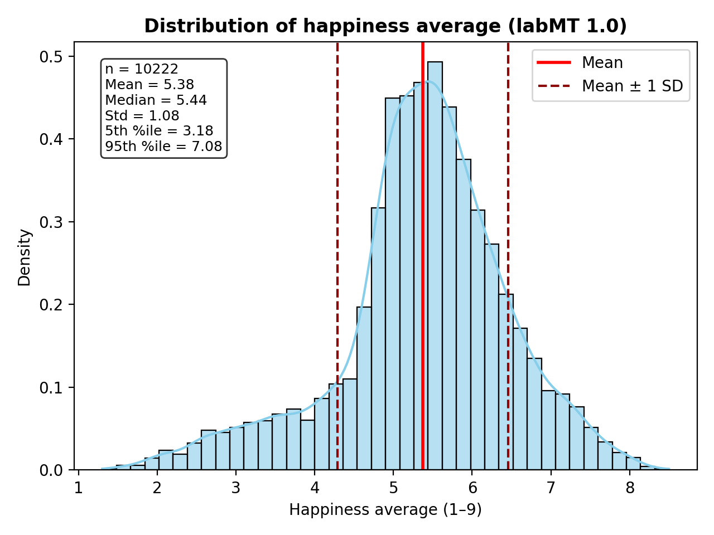
***Figure 1:*** The histogram shows frequency of word appearences across happiness for all 10022 words in the labMT 1.0 dataset. 

**Interpretation:** Happiness scores in the labMT lexicon follow an approximately normal distribution centered slightly above neutral (~5.4), indicating a well-known positivity bias in human language where most words are neutral to mildly positive and strongly valenced words are comparatively rare.

**Unexpected pattern:** Although the distribution appears to be slightly skewed towards the positive scores, the mean (5.38) is very close to the midpoint of the scale (5). One might expect words to be rated more towards the extremes (positive or negative), but the plot suggests perception towards most words are emotionally neutral.

#### Word exhibit for labMT 1.0

| very positive words | very negative words | highly contested words | polarizing words |
|---------------------|---------------------|------------------------|------------------|
| laughter            | terrorist           | fucking                | fucking          |
| happiness           | suicide             | fuckin                 | pussy            |
| love                | rape                | fucked                 | capitalism       |
| happy               | terrorism           | pussy                  | capitalist       |
| laughed             | murder              | whiskey                | islam            |
| laugh               | death               | slut                   | pay              |
| laughing            | cancer              | cigarettes             | alcohol          |
| laughs              | killed              | fuck                   | thunder          |
| excellent           | kill                | mortality              | liquor           |
| joy                 | died                | cigarette              | wolves           |

We can observe that the very positive words in our exhibit, such as laughter, happiness, love, happy, have very high happiness scores and low disagreement, and the very negative words (terrorist, suicide, rape, murder) have very low happiness scores and also relatively low disagreement. On the other hand, the highly contested words such as fucking, pussy, and whiskey have very high disagreement scores. This shows that people do not agree on how positive or negative these words are. 

Agreement and disagreement become a useful concept to read this dataset, because they show that the meanings of some words are relatively stable and widely shared (in the highly positive and highly negative categories), while others are unstable and dependent on context. If we were to look only at the very positive or negative categories, it would feel intuitive that these words receive such scores. However, this intuition fades as we move further from these extreme categories to the more neutral words of the dataset. This is exactly where we can see _tension in meaning_. Words closer to the middle of the scale begin to reveal ambiguity. As much as agreement in happiness scores suggests shared understanding in meaning, neutrality but also disagreement reveals limits of consensus. The category of highly contested words disrupts the notion that meaning is stable, showing that words can be interpreted by some as positive and by others as negative. Words such as fucking or pussy may be used differently across generations, genders, or subcultures. In some communities they function as insults and in others they can be even used as terms of empowerment.

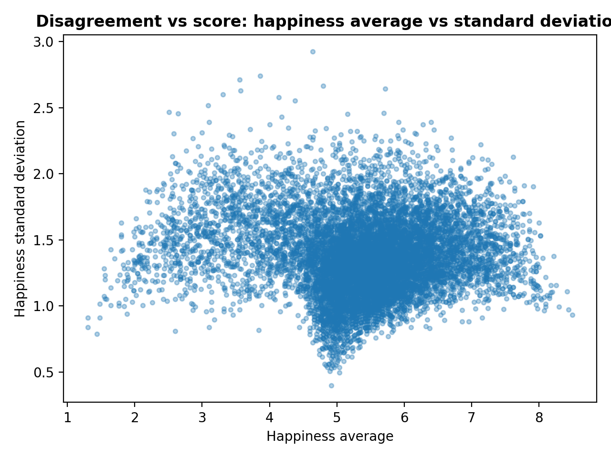
***Figure 2:** Scatter plot for word occurences by their happiness scores against happiness standard deviations*

We deliberately chose polarizing words as an additional word category. While polarizing words are by definition highly contested, their  happiness score is near neutral. In contrast with other highly contested words, which may still lean slightly positive or negative overall, the polarizing category shows how strong disagreement can completely hide behind a neutral score, revealing polysemy or a deep meaning-making divide in society. Why is that important? Because it is hard to discern the specificities and intricacies of the conflict that occurs when trying to define meaning. While the divide in words whose original meaning is imply layered with a new one (for instance, `slut` as an offensive word being used as a form of empowerment within specific communities) still preserves a positive or negative inclination according to the strength of the metonymy-in-process, polarizing words reveal the symmetrical heterogeneity of the metonymies that have been embedded popular culture. Words like `pay` become problematized in relation to another concept that appears to be polarizing, namely `capitalism`. 

Overall, this dataset illustrates that overt emotional register does not always reflect the significance of meaning. A word that does not explicitly "feel" particularly happy or sad can be one that people have invested their entire being in (an interesting example is `islam`, a word that, even though reflecting nothing more than a religious practice, has gone through multiple levels of societal mediation making it a polarizing topic).

**5 of the 15 most contested words:**

- `fuck` (and its other inflected/compounded forms)

  **Profanity/irony/intensifier:** can be associated with taboo in its literal sense, and when used as an intensifier it can still have a negative meaning (for eg: anger), as well as a non-negative one ("fucking awesome")

- `slut`

  **Profanity/Cultural reference:** derogatory term but some communities have reclaimed to bring empowerment and to counter the previous derogatory connotations the label attaches to its referent 

- `pussy`

  **Profanity/ambiguity:** Multiple meanings: cat (expected to be perceived as neutral or positive), female genitalia (taboo), and coward (misogynistic language). The later two meanings with negative implications contest with the neutral/positive meaning 'cat'. 

- `churches`

  **Cultural reference:** positive for religious individual, negative for those opposed to organised religion/christianity. 

- `capitalism`

  **Cultural reference:** perception polarised due to political views, can be associated with exploitation (negative)    

**Connection to quantitative pattern:** All five words except for `churches` have happiness scores lower than but not too far from the mean (`capitalism` comes close with 5.16), and all have SD > 2. This suggests that people are split, but not necessarily in terms of extremes of happiness.

#### Rank comparisons & overlaps

For each corpus there are 5000 labMT words with a recorded rank. This indicates that the labMT dataset contains sentiment scores for all the top 5000 most frequent words in each of these corpora. In other words, the sentiment lexicon has full coverage of the top-frequency vocabulary across these four text sources, allowing consistent sentiment analysis across social media (Twitter), books (Google), news (NYT), and music lyrics.

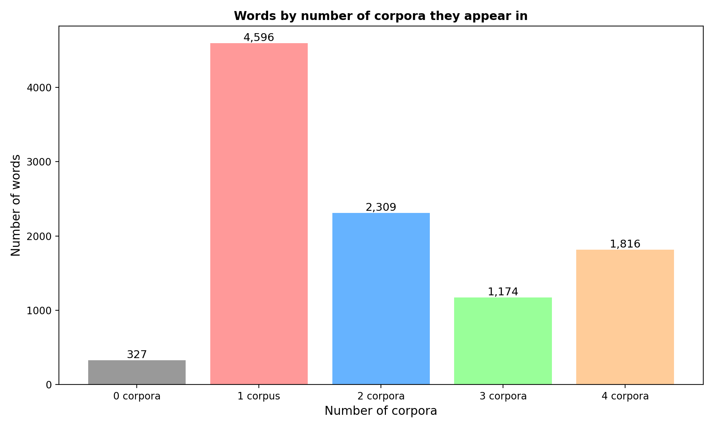
***Figure 3:** Frequency of words across the number of corpora they are present in*

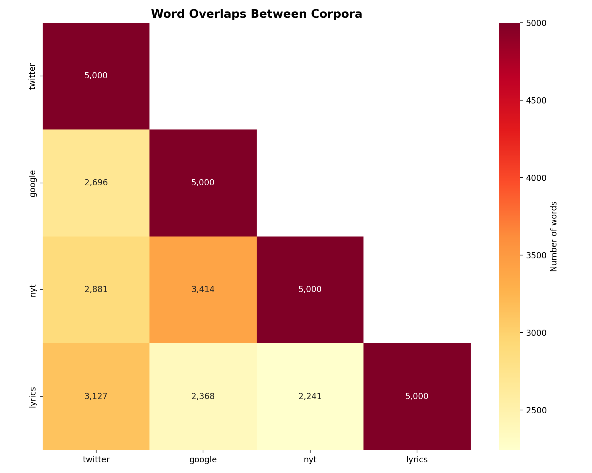
***Figure 4:** Heatmap showing pairwise overlap between each corpus*

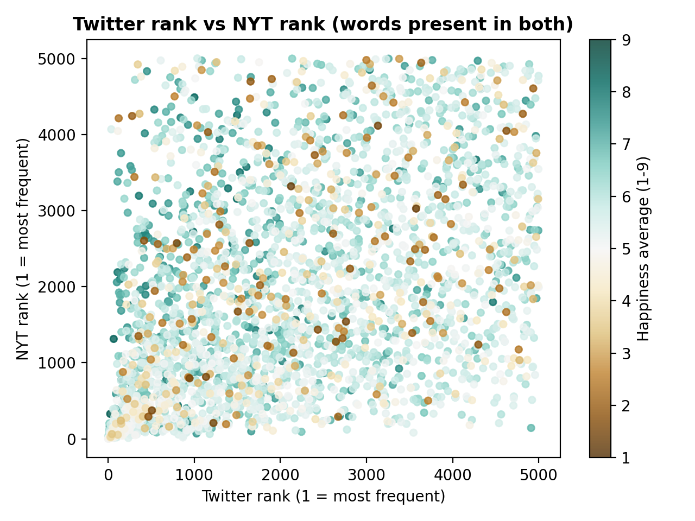
***Figure 5:** Scatter plot for frequency ranks and happiness scores for common words in Twitter and NYT. Words are plotted for their rank in twitter against rank in NYT. The colour scale represents happiness scores.*

**Interpretation**

- Although not as high as non-unique words (total: 5299), there are significant number of corpus unique words (4596)

- Two patterns emerge from the heatmap: 
  - Higher overlap between google and nyt: suggesting common words represent less usage of informal language conventions in these corpora
  - Higher overlap between twitter and lyrics: suggesting common words represent freer usage of informal language conventions

### Critically reflecting on labMT 1.0 
						
#### Consequences and limitations 

**Choice 1**: Homogenizing happiness on a 1–9 numerical scale
  - What they did:
    - The researchers asked raters to assign each word a numerical happiness score from 1 to 9
  - Consequence:
    - Each word is reduced to a single fixed number. Context cannot be included.
  - Example:
    - The word “million” has an average happiness score of 7.38. However, million is just a number. Its emotional meaning depends entirely on context, for example, “a million dollars” (positive meaning). The numerical scale assigns it a stable value even though its meaning is completely situational.

**Choice 2**: Using Mechanical Turk raters
  - What they did:
    - The happiness scores were determined by crowdworkers on Amazon Mechanical Turk.
  - Consequence:
    - The raters’ values reflect their cultural background, beliefs, and assumptions and even mood. Opinions may change over time or differ across communities, making the scores historically and socially situated.
  - Example:
    - The word “wealth” has a happiness average of 7.38. This suggests that raters generally associate wealth with something positive. However, in different ideological or cultural contexts, wealth could also be associated with inequality or greed. Thus, the score reflects particular value systems.

**Choice 3**: Platform influence in word selection
  - What they did:
    - The dataset includes the frequency of words in specific corpora (Twitter, Google Books, NYT, Lyrics).
  - Consequence:
    - The dataset reflects the media environment from which the words were taken. It does not represent all communities equally.
  - Example:
    - The word “valentine’s” appears strongly in lyrics and reflects Western romantic culture.

**Choice 4**: Loss of polysemy
  - What they did: 
    - Every word gets one average happiness rank, with only sanity check being the standard deviation. Considering that meaning is volatile, everchanging and multiplicitous, denying that words can have simultaneous divergent meanings is crude reductivism. 
  - Consequence: 
    - The model assumes a word always has one and the same emotional meaning. It ignores that some words can be read in more than one way and that they can signify multiple things at once. 
  - Example: 
    - The word “mad” inherently has different -if not opposite- meanings such as angry and enthusiastic, the dataset assigns only one meaning to give one average score and ignores the variation that is embedded in language.

**Choice 5**: Topic effect
  - What they did: 
    - Text happiness can only be calculated from the frequency of positive and negative words. 
  - Consequence:
    - The model collapses the category of topic and hegemonic ideology in texts. More negative words may reflect what people are talking about, not how they feel.
  - Example: 
    - Words like “dead” and “damage” increase during a natural disaster. This lowers the happiness score, however, these words might originate from news reporting objective facts rather than describing emotions. Moreover, such words can even be used to infer positive emotion in cases of hate speech, specific political and ideological affiliations, or instances where something that is widely and unilaterally perceived as bad has been eliminated (e.g. Osama bin Laden’s death).

**Choice 6**: Neglecting grammar as communicative of emotion 
  - What they did:
    - The hedonometer treats all the collected words as expressing emotions because the dataset does not include their grammatical function, such as noun, verb, and adjective. 
  - Consequence: 
    - The model does not recognize how a word’s meaning changes when its part of speech changes. Words of various grammatical categories may be used in a sentence to describe an action rather than to express an emotion, but they are still identified by the model as words denoting emotions. Furthermore, colloquialisms and slang, categories that escape formalization, have been known to subvert grammatical structures and rules to express discontent with formalisms and the status quo (of language, politics, society etc). This thereby reduces the accuracy of the happiness level measurement.
  - Example: 
    - The word “damn” can be used as a negative adjective or as a neutral adverb. The model assigns one fixed happiness score to “damn” and does not distinguish between these uses. Therefore, neutral phrases like “it is damn…” may be interpreted as carrying negative emotion. “Word!” (what the hedonometer reads here is  “word”) has a highly positive and emphatic meaning when used by specific communities and demographics.

#### If you were to use this dataset as an instrument today... 

##### What would you trust this dataset to measure well?
The dataset is particularly reliable for detecting large-scale affect shifts in popular culture over time. Random noise and individual-level variation tend to average out when applied to millions of words. This makes the instrument suited for identifying long-term trends and emotional reactions to major public events at the macro level. It can also indicate general patterns in how people typically use words to express positive or negative emotion across common contexts. 
In addition, by comparing word frequency patterns and happiness value, the dataset can be used to analyze differences in linguistic style across platforms, which reveals how various media environments encode and circulate emotional language differently. Finally, it can be used to identify large-scale moods per corpus. 

##### What would you refuse to claim based on it?
It cannot accurately represent specific or minority groups because the method relies on large-scale aggregation. The overall score reflects dominant textual patterns, which may overshadow smaller communities. As a result, the dataset is not suitable for making claims about emotional experiences of marginalized people. It is primarily indicative of hegemonic emotion and its reflection on the vast majority of people.

##### What improvements would you make if you rebuilt it? 
We would:
- aim for giving each word three potential happiness ranks instead of one. In that way word happiness would appear as one or more ranges in the scale rather than an approximate number. While not universally applicable, opening up the potential of accounting for polysemy within the function of the hedonometer. This way, clusters of individual rankings would accumulate and account for a word's multiplicity of meaning and variance in affect.
- use words from more culturally diverse corpora. For example, even though New York Times has a place in the dataset, Al Jazeera doesn’t, therefore getting very culturally specific word uses. 
- construct a multilingual model. The dataset would need more mediating tools to be usable, but by following a multilingual model, the hedonometer would not perpetuate the Anglophone dominance of popular culture. Especially in the case the hedonometer as a tool that demands the taking for granted of many assumptions, a multilinguage dataset would eliminate some of the implicit cultural bias affecting the results. 

## 3. Guardian Happiness Results

### Sampling plan

- Sample: All Guardian articles retrieved from the API for the periods 2010‑13 and 2020‑23,
  filtered to sections "World news", "Politics", "Opinion", and with valid happiness scores 
  (see operalisation in src/compute_lambt_scores.py).

- Population: Conceptualised as a superpopulation of all possible articles that could have
  been written under similar editorial policies. We use bootstrapping to quantify uncertainty
  due to sampling variability.

- Methods (descriptive + bootstrap): kiba kiba kiba kibakibakibakibakiba

### Descriptive Statistics

Table 1 shows summary statistics for each section‑period group. [Optional: comment on sample sizes, skewness, etc.]

| Section   | Period    | Count | Mean  | Std   | Min   | 25%   | 50%   | 75%   | Max   | Skew | Kurtosis |
|-----------|-----------|-------|-------|-------|-------|-------|-------|-------|-------|------|----------|
| Opinion   | 2010‑13   | 25    | 5.749 | 0.254 | 5.192 | 5.613 | 5.799 | 5.914 | 6.204 | -0.520 | 0.044 |
| Opinion   | 2020‑23   | 31    | 5.866 | 0.240 | 5.455 | 5.720 | 5.858 | 6.046 | 6.461 | 0.337 | -0.084 |
| Politics  | 2010‑13   | 79    | 6.061 | 0.275 | 5.590 | 5.794 | 6.090 | 6.331 | 6.430 | -0.206 | -1.681 |
| Politics  | 2020‑23   | 26    | 5.933 | 0.207 | 5.581 | 5.764 | 5.956 | 6.109 | 6.276 | -0.101 | -1.076 |
| World news| 2010‑13   | 18    | 5.897 | 0.225 | 5.291 | 5.797 | 5.919 | 6.016 | 6.235 | -0.985 | 2.031 |
| World news| 2020‑23   | 18    | 5.845 | 0.319 | 5.271 | 5.629 | 5.850 | 6.064 | 6.443 | -0.064 | -0.491 |

#### Visualisation

Figure 1 shows the distribution of happiness scores for the two time periods (pooling sections). The density curves overlap substantially, but a slight shift towards lower scores in 2020‑23 is visible.

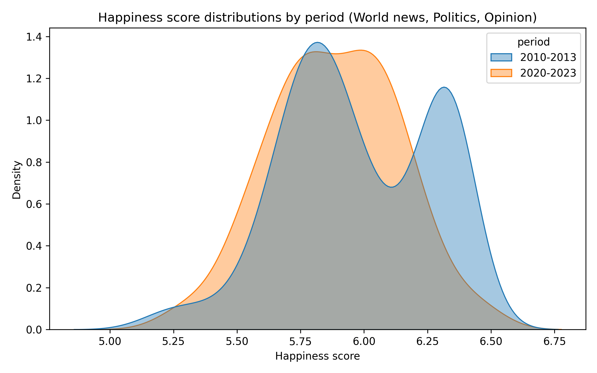  
*Figure 1: Density plot of happiness scores for 2010‑13 and 2020‑23 (all sections combined).*

Figure 2 displays the distributions by section (ignoring period). Politics articles tend toward higher happiness values, while Opinion shows a slightly lower peak.

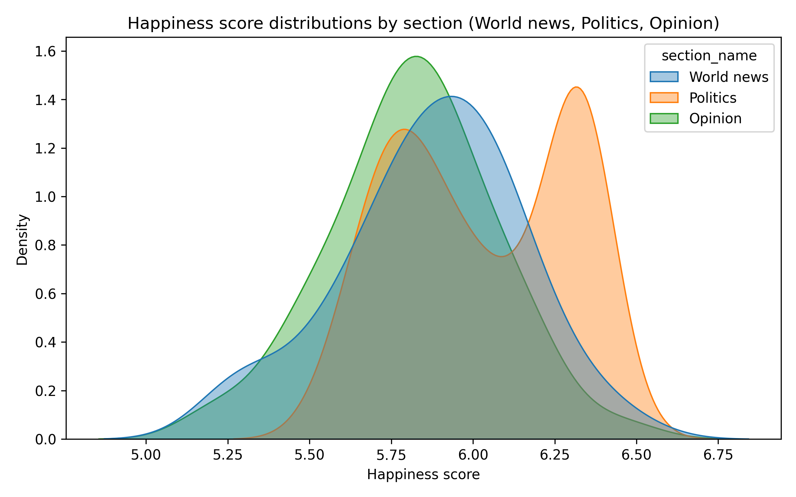  
*Figure 2: Density plot of happiness scores for World news, Politics, and Opinion (both periods pooled).*

Figure 3 presents boxplots for each section‑period group, highlighting medians, quartiles, and outliers. The decrease in Politics over time is evident, while Opinion appears to increase slightly.

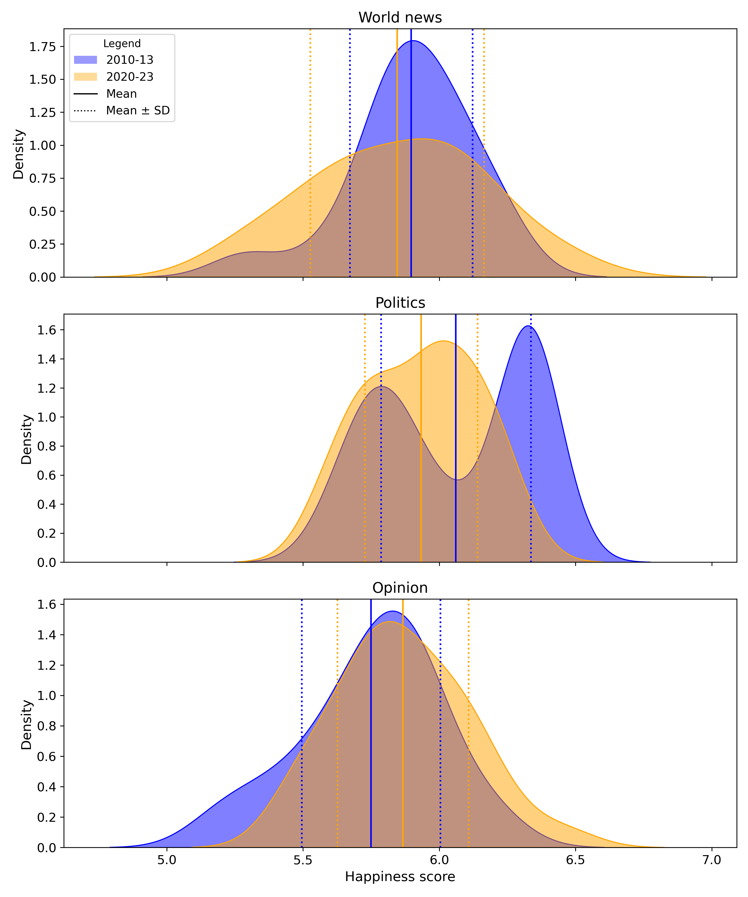  
*Figure 3: Boxplot of happiness scores for each section and period.*

### Inferential Statistics

All confidence intervals are 95% bootstrap intervals based on 10,000 resamples.

#### Comparison 1: Overall Period Difference
The mean happiness across all sections in 2020‑23 was <!-- [DIFF]--> **-0.088** points lower than in 2010‑13, with a 95% bootstrap confidence interval of <!--[LOWER, UPPER]--> **-0.165, -0.011**. Since the entire interval lies below zero, we conclude that happiness decreased overall between the two periods.

Fig 4 shows the bootstrap distribution of this difference; the red line is the observed difference, and the blue dashed lines mark the 95% CI.

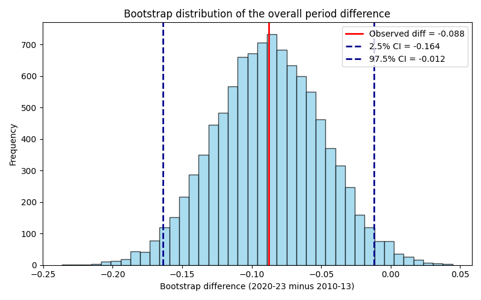  
*Figure 4: Bootstrap distribution of the mean difference (2020‑23 minus 2010‑13). The red line is the observed difference, blue dashed lines are the 95% CI.*

Fig 5 displays the bootstrap distributions of the mean happiness for each period (all sections combined). The separation between the two distributions reflects the uncertainty around the period means and confirms the downward shift.

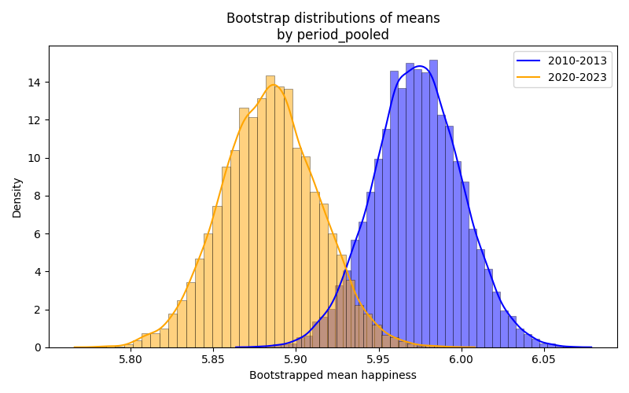  
*Figure 5: Bootstrap distributions of the mean happiness for each period, showing the uncertainty around the period means (all sections combined).*

**Critical analysis**

The overall slight decrease in happiness noticed in our dataset between the two periods (2010-2013 and 2020-2023) could be partly attributed to broader changes in the global political and social context of each era. Especially the years after 2020 have seen several major global crises, such as the COVID-19 pandemic and geopolitical conflicts such as the wars in Ukraine and Gaza. These events could be used to think of why there could be a general negative sentiment shift in media coverage. It is important to mention that the point is not to conclude that the second period has more extreme events or has seen worse incidents but we could use major crisis events during the second interval to begin to explain the emotional shifts in our examined dataset. 

With that in mind, global instability during the second period may have been mediated through the media in the form of conflict- and problem-focused narratives, resulting in a less positive overall tone in news. The slightly lower happiness scores observed in the later period may reflect the increased prominence of crisis-related language in the news that aligns with the political instability caused by these major events. (Boydstun, Hardy, and Walgrave 2014).

However, the observed slight decrease should also be interpreted with caution, as it may partly reflect methodological characteristics of the hedonometer. The labMT lexicon, developed in the early 2010s, which is responsible for the happiness scoring, itself is influencing sentiment shift. As the words were initially captured in the 2010s, coinciding with the first period examined, changes in language and word usage might be obscured and under-represent for the second period. The lexicon was constructed from the most frequently occurring words in specific corpora (Google books, NYT, Twitter and lyrics) during the first period, and this means that the initial dataset could represent language patterns from the early 2010s more accurately than in the second period. Lastly, only words that appear in the lexicon contribute to the total happiness calculation. In our dataset, approximately 19% of the words in each article matched the labMT dictionary, so the sentiment score reflects just a subset of the article’s vocabulary. 

#### Comparison 2: Differences Between Sections
Pairwise comparisons (ignoring period) reveal:
- **Politics vs World news**: Politics is happier by <!--[DIFF_PW]--> **0.158** points (95% CI <!--[LOWER, UPPER]--> -0.056, 0.261).
- **World news vs Opinion**: No significant difference (diff = <!--[DIFF_WO]--> **-0.056**, 95% CI <!--[LOWER, UPPER]--> -0.166, 0.052).
- **Politics vs Opinion**: Politics is happier by <!--[DIFF_PO]--> **+0.215** points (95% CI <!-- [LOWER, UPPER]--> 0.131, 0.298).

Thus, Politics articles consistently score higher than the other two sections, while World news and Opinion are statistically similar.

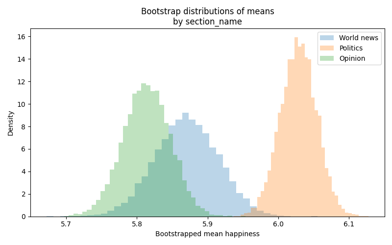  
*Figure 6: Bootstrap distributions of the mean happiness for each section, showing the sampling variability of the section means.*

**Critical analysis**

Now that the overall shift in happiness across time periods has been examined, it is useful to look more closely at differences between sections to better understand how sentiment is distributed in the dataset. Rather than focusing only on chronological events that might influence the emotional tone of news, analysing the data by section allows us to consider how language is used differently across types of journalism. This perspective helps interpret the results in terms of the agendas and reporting styles that shape media coverage.

The overall trend observed was that Politics articles appear more positive than Opinion and World news. Here, it is useful to consider how media organisations such as the Guardian structure coverage around particular topics within different sections. From an agenda-setting perspective (McCombs and Shaw 1972), different sections tend to emphasise different types of issues and therefore employ different kinds of language. Opinion articles, for example, often involve commentary and critique and therefore use more critical vocabulary. The World News section frequently reports on major global events, conflicts, or crises, which can involve more negative terms. Political reporting often focuses on institutional processes such as policy, decisions and negotiations and therefore tends to rely on relatively neutral language. These differences in reporting style may therefore influence the sentiment scores observed across sections.

Looking closely at our dataset offers some explanation to why Politcs articles scored slightly more positively. Many politics articles indeed include institutional language with reccuring words such as policy and government. In the labMT dictionary, these words typically receive higher scores (usually neutral). In contrast, words associated with conflict, war, or crisis are more common in World News and receive lower scores in the lexicon.

#### Comparison 3: Period Change Within Each Section

- **World news**: No significant change (diff = <!--[DIFF_WN]--> **-0.052**, 95% CI <!--[LOWER, UPPER]--> -0.228, 0.129).
- **Politics**: Significant decrease of <!--[DIFF_P]--> **-0.127** points (95% CI <!--[LOWER, UPPER]--> -0.227, -0.029).
- **Opinion**: No significant change (diff = <!--[DIFF_O]--> **0.118**, 95% CI <!--[LOWER, UPPER]--> -0.009, 0.250), though the interval is mostly positive, hinting at a possible increase.

Fig 7 presents the bootstrap distributions of the mean for each section‑period group, allowing direct visual comparison of the uncertainty and central tendency for the two periods within each section. The separation (or overlap) between the 2010‑13 and 2020‑23 distributions for each section reflects the evidence for a change

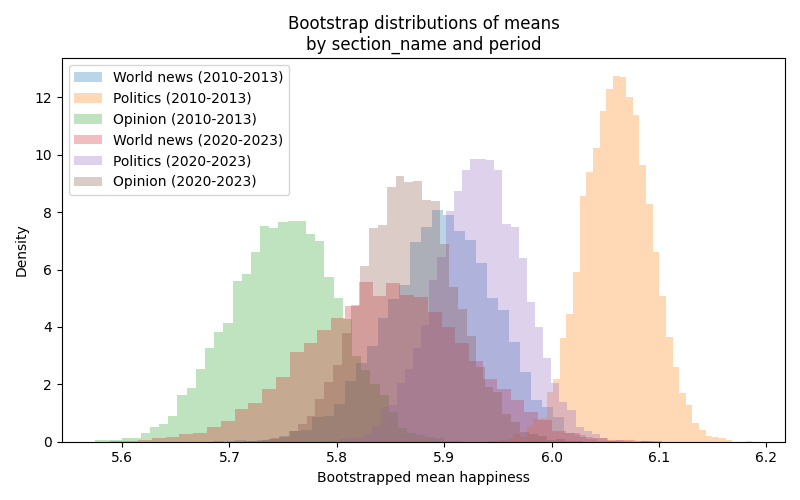  
*Figure 7: Bootstrap distributions of the mean happiness for each section‑period group.*

Fig 8 shows the point estimates with 95% confidence intervals for each group, making it easy to see the magnitude and uncertainty of the differences.

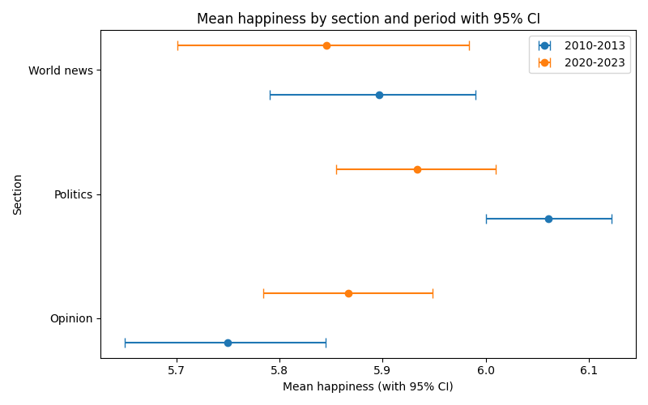  
*Figure 8: Point plot with 95% confidence intervals for each section‑period group.*

**Critical analysis**

The bootstrapped distribution of means of happiness scores per period by section reveals deviations between different chronological periods of the same section, different sections within the same period, and, arguably most importantly, positions each chronologically bound section on the happiness scale. Since the deviations happen within the span of 5.6 to 6.2 happiness mean score, the neutrality of the genre of journalism has to be taken into consideration. However, it is noteworthy that, for instance, the 2010-2013 Opinions section of the Guardian is the least happy conjuncture from the data we examined, while Politics 2010-2013 is the happiest. World News from 2010-2013 also seems to be slightly happier than in 2020-2023. With 2010-2013 sections occupying both ends of the bootstrapped distribution and two out of the three sections examined scoring higher than their counterparts in 2020-2023, it seems reasonable to talk of a divide between what official report fully endorsed by the institution aims to convey and what individual journalists and public intellectuals have to say about current events in the early 2010s (Said 1994). 

The Opinion and Politics sections for 2020-2023 seems to be closer to alignment. Politics is still holding the happier position from the two, however Opinion seems to not be falling that far behind. This “bridging” of the gap between the two categories in later years may signify a more censored journalistic exposure, with pieces that challenge the overall affective ambience of the Guardian being replaced with viewpoints on current events that are more affirmative of the institution that hosts them. Interestingly, World News from the early 2020s occupy the least happy positions of the period, exhibiting a slight trend to a more neutral, or perhaps less positive, position on reporting. Compared to World News from 2010-2013, World News 2020-2023 is visibly less positive. Such a trend could relate to the rise of isolationist alt-right sentiments in the US, prioritizing the nation as source of happiness while upholding a specific kind of epistemic, cultural and, as could be deduced from our data, affective hierarchy on the premise of national borders (Anderson 1983git add ). 

#### Coverage

On average, only about 19-20% of words per article contributed to the happiness scores. This means the scores are based on a limited emotional vocabulary, which should be considered when interpreting the results.

| Section     | 2010‑13 | 2020‑23 |
|-------------|---------|---------|
| Opinion     | 0.191   | 0.190   |
| Politics    | 0.198   | 0.189   |
| World news  | 0.194   | 0.201   |

*Table 2: Average proportion of matched words (coverage) by section and period.*

### Positive, negative, highly contested, polarizing words in Guardian

#### Very positive

| word       | happiness_score | 
|------------|-----------------|
| laughter   | 8.5             |
| happiness  | 8.44            |
| love       | 8.42            |
| happy      | 8.3             |
| laughed    | 8.26            |
| laugh      | 8.22            |
| laughing   | 8.2             |
| excellent  | 8.18            |
| laughs     | 8.18            |
| successful | 8.16            |

#### Very negative

| word      | happiness_score |
|-----------|-----------------|
| terrorist | 1.3             |
| suicide   | 1.3             |
| rape      | 1.44            |
| terrorism | 1.48            |
| murder    | 1.48            |
| cancer    | 1.54            |
| death     | 1.54            |
| died      | 1.56            |
| kill      | 1.56            |
| killed    | 1.56            |

#### Highly contested

Words with high variance in happiness ratings.

| word       | happiness_score | happiness_std |
|------------|-----------------|--------------|
| fucking    | 4.64            | 2.926        |
| pussy      | 4.8             | 2.665        |
| cigarettes | 3.31            | 2.5997       |
| fuck       | 4.14            | 2.5794       |
| mortality  | 4.38            | 2.5546       |
| cigarette  | 3.09            | 2.5163       |
| churches   | 5.7             | 2.4599       |
| capitalism | 5.16            | 2.4524       |
| porn       | 4.18            | 2.4302       |
| summer     | 6.4             | 2.3905       |

#### Polarizing

Words that elicit particularly diverse happiness ratings.

| word       | happiness_score | happiness_std |
|------------|-----------------|--------------|
| fucking    | 4.64            | 2.926        |
| pussy      | 4.8             | 2.665        |
| capitalism | 5.16            | 2.4524       |
| capitalist | 4.84            | 2.3418       |
| islam      | 4.68            | 2.325        |
| pay        | 5.3             | 2.3234       |
| alcohol    | 5.2             | 2.3212       |
| thunder    | 5.06            | 2.2983       |
| recall     | 4.6             | 2.2768       |
| socialism  | 4.96            | 2.2727       |

### Comparative Word Exhibit

#### labMT 1.0

| very positive words | very negative words | highly contested words | polarizing words |
|---------------------|---------------------|------------------------|------------------|
| laughter            | terrorist           | fucking                | fucking          |
| happiness           | suicide             | fuckin                 | pussy            |
| love                | rape                | fucked                 | capitalism       |
| happy               | terrorism           | pussy                  | capitalist       |
| laughed             | murder              | whiskey                | islam            |
| laugh               | death               | slut                   | pay              |
| laughing            | cancer              | cigarettes             | alcohol          |
| laughs              | killed              | fuck                   | thunder          |
| excellent           | kill                | mortality              | liquor           |
| joy                 | died                | cigarette              | wolves           |

---

#### Guardian

| very positive words | very negative words | highly contested words | polarizing words |
|---------------------|---------------------|------------------------|------------------|
| laughter            | terrorist           | fucking                | fucking          |
| happiness           | suicide             | pussy                  | pussy            |
| love                | rape                | cigarettes             | capitalism       |
| happy               | terrorism           | fuck                   | capitalist       |
| laughed             | murder              | mortality              | islam            |
| laugh               | cancer              | cigarette              | pay              |
| laughing            | death               | churches               | alcohol          |
| excellent           | died                | capitalism             | thunder          |
| laughs              | kill                | porn                   | recall           |
| successful          | killed              | summer                 | socialism        |

### Interpretation of the Word Exhibit 

The reconstructed word exhibit highlights the range of emotional vocabulary present in the Guardian corpus when evaluated using the labMT happiness lexicon. The very positive words in the corpus, such as laughter, happiness, love, and happy, are associated with positive social experiences and cultural topics. These words often appear in sections related to lifestyle, culture, or human-interest stories, which tend to use language describing enjoyment, success, or celebration. 

In contrast, very negative words such as terrorist, suicide, rape, terrorism, and murder are strongly associated with violence, conflict, and tragedy. These topics frequently appear in journalistic reporting, particularly in sections covering politics, international affairs, or crime. The prominence of such vocabulary reflects the broader role of news media in reporting crises and social problems. 

The corpus also contains several highly contested words, including fucking, pussy, and cigarettes. These words have high standard deviations in the labMT dataset, indicating disagreement among annotators about their emotional valence. Their presence suggests that the emotional interpretation of certain words depends strongly on context, tone or quotation, which is common in opinion pieces or informal speech reproduced in news articles. 

Finally, the exhibit includes several polarizing words such as capitalism, capitalist, Islam, and socialism. These terms are closely linked to political and ideological debates and may evoke different emotional responses depending on the perspective of the reader or the political context of the article. Their appearance in the corpus likely reflects ongoing discussions about economic systems, religion, and global politics.

Overall, the word exhibit illustrates how the emotional vocabulary of the Guardian corpus is shaped both by the thematic structure of journalism and by broader political and social debates.

### How to run the code 

The files in src/ include the runable code for this project. Starting from src/load_labmt.py to load the cleaned data, we then moved to quantitative_exploration.py where the standard deviation, average happiness etc are calculated in the form of reusable functions and where relevant plots (hist_happiness_average.png, scatter_happiness_vs_std.png, bar_corpus_rank_coverage.png) are created and saved in figures/. By running the code in qualitative_exploration.py, we are entering the final stage of the project in its current form, where the 10 most positive, most negative, highly contested and polarizing words are are fetched. The code in qualitative_exploration.py also generates the two plots relating to 1. the 4 aforementioned categories (labmt_top_10_per_cat.png) and 2. the "word exhibit" (labmt_word_exhibit.png).

++++ the rest of the code (for deadline 2)

## Credits and role

Kevin's responsibilities included managing the Git repository and coordinating the synchronization process. Git repositories are efficient tools for sharing code and collaborating, but most of our group members had never used Git before. Therefore, Kevin first familiarized himself with Git repositories, helped create the job's reprocitories, and guided the others in linking them. We also discovered that if multiple people were editing code simultaneously, Git might encounter errors when pushing updates, so coordinating the editing order and timing was crucial.

Tianye's responsibilities included initial cleaning and categorizing of raw data, facilitating the interpretation of the "Distribution of happiness_average" histogram, the "happiness_average vs happiness_standard_deviation" scatter graph, the "corpus_rank_coverage_bar" chart, and the "twitter_rank_vs_nyt_rank_scatter" chart. As a first-time-user of VS Code and GitHub, Tianye also quickly familiarized himself with the basic operating system of such tools and basic coding logic, which helped him tremendously when he directly addressed the very first technical task of cleaning and categorizing the raw data and putting those data into visually pleasant columns. Besides that, Tianye worked closely with other teammates, especially Arav in the quantitative analysis section, to ensure a coherent workflow for the rest of the tasks and the collective.

Leah's responsibilities included creating the qualitative exploration word exhibit. Collaborated with Chrysoula and Yuki on the critical reflection (mainly 4.2 and the last part of 4.3) and oversaw the editing of the README.md (especially pertaining to the critical analysis and conclusions).

Yuki/Yuxuan's responsibilites included creating the data dictionary and sanity cheaks. Collaborated with Sisi and Leah on the critical reflection (mainly 4.2 and the first and second of 4.3). 

Chrysoula was responsible for parts of the qualitative exploration and of the critical reflection of the dataset. Her work included generating a qualitative exhibit of words and conducting an interpretive analysis of the dataset, with a particular focus on disagreement, neutrality, deviation, and the polarising effect. She also wrote the reconstruction of the data pipeline, paying close attention to the Dodds reading, and contributed to the discussion of dataset design choices by writing Choices 1, 2, and 3.

Arav was responsible for great deal of the code for the quantitative exploration of the dataset. He worked closely with Tianye.

++++ updated responsibilities 

## The usage of AI tools
 
We utilized intelligent tools, including UVA AI, to assist in writing and modifying our code. AI is a great help to us quickly learn code and advance tasks. We use it to guide us in writing code and help us analyze errors. At the same time, we don't forget not to lose control of the code. We require the AI ​​to interpret everything it generates to ensure that the entire project is always under our control, and to let the AI ​​only serve as an auxiliary tool to provide technical support. AI was of particular use in the creation of plots for the qualitative analysis, as well as for piecing together interpretations of the code written by our team members. 

## Bibliography

Althusser, L. (1970). *Ideology and Ideological State Apparatuses*
Anderson, B. (1983). *Imagined Communities*.
Berlant, L. (2011). *Cruel Optimism*
Boydstun, A., Hardy, A., & Walgrave, S. (2014). *Two Faces of Media Attention*.
McCombs, M., & Shaw, D. (1972). *The Agenda-Setting Function of Mass Media*.
Said, E. (1994). *Representations of the Intellectual*.
Soroka, S. (2014). *Negativity in Democratic Politics*.